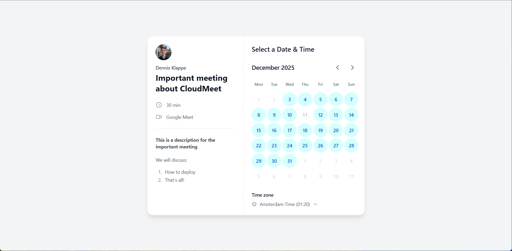

# Scheduler

A free, open-source meeting scheduler that runs on Cloudflare. Open-source Calendly alternative with Google Calendar and Outlook Calendar integration.



**[Live Demo](https://meet.klappe.dev/cloudmeet)**

## Features

- Google Calendar and Outlook Calendar integration
- Use Google alone, Outlook alone, or both calendars together
- Automatic event creation with Google Meet or Microsoft Teams links
- Customizable availability and working hours
- Multiple event types (30 min, 1 hour, etc.)
- Configurable email notifications (confirmation, cancellation, reminders)
- Email settings dashboard to enable/disable and customize emails
- One-click deploy and update via GitHub Actions
- Runs entirely on Cloudflare's free tier

## Quick Start

### 1. Create Cloudflare API Token

1. Go to [Cloudflare API Tokens](https://dash.cloudflare.com/profile/api-tokens)
2. Click **Create Token**
3. Select **Edit Cloudflare Workers** template
4. Under **Account Resources**, select your account
5. Click **+ Add more** and add: **Account → D1 → Edit**
6. Click **Continue to summary** → **Create Token**
7. Copy the token for step 4

### 2. Setup Google OAuth

1. Go to [Google Cloud Console](https://console.cloud.google.com/)
2. Create a new project
3. Go to **APIs & Services** > **Library** > Enable **Google Calendar API**
4. Go to **APIs & Services** > **Credentials**
5. Click **Create Credentials** > **OAuth 2.0 Client ID**
6. Application type: **Web application**
7. Add authorized redirect URI: `https://YOUR-PROJECT.pages.dev/auth/callback`
   - Replace `YOUR-PROJECT` with your Cloudflare Pages project name (you'll get this URL after first deploy, or use your custom domain if you already have one)
   - You can add multiple redirect URIs, so add both the default and custom domain if needed
8. Save your **Client ID** and **Client Secret** for step 4

### 3. Create your repository

Click **Use this template** > **Create a new repository**.

### 4. Add Repository Secrets

Go to your new repo's **Settings** > **Secrets and variables** > **Actions** > **New repository secret**.

Add these secrets (click "New repository secret" for each one):

| Secret | Required | Description |
|--------|----------|-------------|
| `CLOUDFLARE_API_TOKEN` | Yes | Your Cloudflare API token from step 1 |
| `CLOUDFLARE_ACCOUNT_ID` | Yes | Your [Cloudflare Account ID](https://dash.cloudflare.com) (right sidebar) |
| `ADMIN_EMAIL` | Yes | Your Google email (only this account can login) |
| `JWT_SECRET` | Yes | Random string for session tokens ([generate one](https://generate-secret.vercel.app/32)) |
| `APP_URL` | Yes | Your app URL (e.g., `https://YOUR-PROJECT.pages.dev` or your custom domain) |
| `GOOGLE_CLIENT_ID` | Yes | From step 2 (ends with `.apps.googleusercontent.com`) |
| `GOOGLE_CLIENT_SECRET` | Yes | From step 2 |
| `EMAILIT_API_KEY` | No | [Emailit](https://emailit.com) API key for booking emails |
| `EMAIL_FROM` | No | From address (e.g., `noreply@yourdomain.com`) |
| `CRON_SECRET` | No | Secures reminder endpoint ([generate one](https://generate-secret.vercel.app/32)) |
| `MICROSOFT_CLIENT_ID` | No | For Outlook Calendar integration (see below) |
| `MICROSOFT_CLIENT_SECRET` | No | For Outlook Calendar integration (see below) |

### 5. Deploy

Go to **Actions** > **Deploy to Cloudflare Pages** > **Run workflow** > **Run workflow**.

Your app will be live at `https://YOUR-PROJECT.pages.dev`.

### Custom Domain (Optional)

1. Go to [Cloudflare Dashboard](https://dash.cloudflare.com) > **Pages** > **cloudmeet** > **Custom domains**
2. Add your domain
3. Update `APP_URL` secret to your new domain
4. Update redirect URI in [Google Cloud Console](https://console.cloud.google.com/) to `https://yourdomain.com/auth/callback`
5. Re-run the deploy workflow

## Updating

To get the latest updates from the template and deploy:

1. Go to **Actions** > **Sync and Deploy** > **Run workflow** > **Run workflow**

This repository is set up for deployment to Cloudflare Pages.

Alternatively, you can run **Upstream Sync** and **Deploy to Cloudflare Pages** separately.

If sync fails with a permissions error, [create a personal access token](https://github.com/settings/tokens/new) with `Contents` and `Workflows` permissions, and paste it in the token field when running the workflow.

## Email Reminders

Email reminders are automatically enabled when you deploy. A Cloudflare Worker runs every 5 minutes to check for and send scheduled reminders (24h, 1h before meetings).

**Note:** The `CRON_SECRET` is optional but recommended. Without it, the reminder endpoint is publicly accessible (anyone could trigger reminder sends). With it, only the cron worker can trigger reminders.

To add the secret:
1. Add a `CRON_SECRET` to your GitHub secrets (any random string)
2. Re-deploy via **Actions** > **Deploy to Cloudflare Pages**

The cron worker is deployed automatically alongside the main app.

## Outlook Calendar Integration (Optional)

CloudMeet supports Microsoft Outlook Calendar in addition to Google Calendar. You can use Google alone, Outlook alone, or both together. When both are connected, availability is checked across both calendars.

### Setup Microsoft OAuth

1. Go to [Azure Portal](https://portal.azure.com/) > **App registrations** > **New registration**
2. Name: `CloudMeet` (or your preferred name)
3. Supported account types: **Accounts in any organizational directory (Any Microsoft Entra ID tenant - Multitenant) and personal Microsoft accounts (e.g. Skype, Xbox)**
4. Redirect URI: **Web** > `https://YOUR-DOMAIN/auth/outlook/callback`
5. Click **Register**
6. Copy the **Application (client) ID** - this is your `MICROSOFT_CLIENT_ID`
7. Go to **Certificates & secrets** > **New client secret**
8. Copy the secret value - this is your `MICROSOFT_CLIENT_SECRET`
9. Go to **API permissions** > **Add a permission** > **Microsoft Graph** > **Delegated permissions**
10. Add these permissions:
    - `Calendars.ReadWrite`
    - `User.Read`
    - `OnlineMeetings.ReadWrite` (for Teams meeting links)
11. Click **Grant admin consent** (if you have admin access, otherwise users consent on first login)

### Add Secrets

Add `MICROSOFT_CLIENT_ID` and `MICROSOFT_CLIENT_SECRET` to your GitHub secrets and re-deploy.

### Usage

Once configured, users can connect their Outlook calendar from the dashboard:
- Go to **Dashboard** > **Calendar Integrations**
- Click **Connect** next to Outlook Calendar

## CalDAV (iCloud) two-way sync (Optional)

If you prefer iCloud Calendar, you can enable **CalDAV** so:

- Availability is fetched from your calendar (busy times block slots)
- Bookings are written back as events
- Cancellations/reschedules update the calendar event

Set these environment variables in your Cloudflare Pages project (and in `.dev.vars` for local dev):

- `CALDAV_CALENDAR_URL` (full calendar collection URL)
- `CALDAV_USERNAME` (your iCloud Apple ID email)
- `CALDAV_PASSWORD` (an app-specific password)
- Choose which calendars to use for availability checking
- Select preferred meeting provider (Google Meet, Teams, or none)

## Local Development

```bash
cp .env.example .dev.vars  # Add your credentials
npm install
npm run db:init
npm run dev
```

## Native Embed (No iFrame)

This repository ships an embeddable **web component** that renders natively on any site (no iframe).

### 1) Build output

When you run `npm run build`, it will also run `npm run build:widget` and emit a single CDN-friendly script:

- `static/widget/cloudmeet-widget.js`

After deploying to Cloudflare Pages, it will be available at:

- `https://YOUR_DOMAIN/widget/cloudmeet-widget.js`

### 2) Add to any website

```html
<script src="https://YOUR_DOMAIN/widget/cloudmeet-widget.js" defer></script>

<schedule
  event="YOUR_EVENT_SLUG"
  base-url="https://YOUR_DOMAIN"
  lang="en"
></schedule>
```

#### Options

- `event` (required): the event type slug (same as the booking page URL slug)
- `base-url` (recommended): your deployment origin (used for cross-domain API calls)
- `lang`: `en` (default) or `ar`
- `lang`: set to `ar` to render the widget in Arabic (RTL)

### Arabic (RTL)

Set `lang="ar"` and the widget will render RTL with Arabic UI labels.

### Test embed locally

After starting the local dev server, open the built-in test page:

```text
http://localhost:8788/embed-test.html
```

That page loads the widget from `/widget/cloudmeet-widget.js` and mounts `<schedule>` directly (no iframe).


## License

MIT

## Embedding the scheduler (no iframe)

This repo ships a **native embed widget** (no iframe). You embed it by placing a mount `<div>` and loading a single script from your scheduler origin (recommended: `book.domain.com`).

### Embed snippet (for `domain.com` / Webstudio HTML Embed)

Paste this into a Webstudio **HTML Embed** component (see Webstudio guide).

> In Webstudio, enable **Client Only** (recommended) and **Run Script on Canvas** if you want to preview it in the builder.

```html
<div
  data-schedule
  data-event="demo-meeting"
  data-base-url="https://book.domain.com"
  data-lang="en"
></div>

<script src="https://book.domain.com/widget/schedule-widget.js" defer></script>
```

### Security: CORS allowlist (required for cross-site `fetch`)

Because the widget runs on `domain.com` but calls APIs on `book.domain.com`, we enable CORS **only** for these public widget endpoints:

- `/api/public/event-type/*`
- `/api/availability/*`
- `/api/bookings`

CORS is controlled by an **origin allowlist** env var:

- `WIDGET_ALLOWED_ORIGINS` (preferred) or `CORS_ALLOWED_ORIGINS`

Set it to the exact origins that may embed the widget, comma-separated, for example:

- `https://domain.com,https://www.domain.com`

If you don’t set it, local development defaults allow `http://localhost:5174` so you can test easily.

### Recommended production setup

1. Host the scheduler on `https://book.domain.com`
2. Add `WIDGET_ALLOWED_ORIGINS=https://domain.com,https://www.domain.com` in your Cloudflare Pages project env vars
3. Keep the scheduler dashboard/admin on `book.domain.com` (same-origin) while the widget remains cross-origin but **restricted** by the allowlist
4. Keep using HTTPS everywhere

### Booking endpoint abuse protection (recommended)

The booking endpoint (`POST /api/bookings`) is intentionally public so the widget can create bookings.
To keep Cloudflare usage low and prevent spam, use a **two-layer** approach:

1) **Cloudflare WAF Rate Limiting Rule (recommended)**

Create a rate limiting rule targeting:

- Hostname: `book.<your-domain>`
- Path: `/api/bookings`
- Method: `POST`

Suggested thresholds:

- 10 requests / 1 minute / per IP → **Managed Challenge**
- 50 requests / 1 hour / per IP → **Block**

2) **Lightweight in-app checks** (already implemented)

- Enforces `Origin`/`Referer` allowlist using `WIDGET_ALLOWED_ORIGINS` (blocks direct bot/cURL calls from other sites)
- Honeypot field: `company_website` must be empty
- Minimum time-to-submit: `client_started_at` must be at least ~1.5s in the past (blocks naive instant POSTs)

### Local testing (replaces the old widget-test)

This repo includes a simple host page at `examples/embed-host/index.html` that simulates your marketing site origin.

In two terminals:

**Terminal A (scheduler app):**
```bash
npm install
npm run dev
```

This serves the scheduler on `http://localhost:8788` (via `wrangler pages dev`).

**Terminal B (fake marketing site on a different origin):**
```bash
npx serve examples/embed-host -l 5174
```

Open `http://localhost:5174` and confirm:
- The widget UI renders
- Availability loads (CORS working)
- Booking submits successfully (POST CORS working)

If you change the host port/origin, update `WIDGET_ALLOWED_ORIGINS` accordingly.


## No indexing (robots)

This project is configured to **not** be indexed by search engines:

- `X-Robots-Tag: noindex, nofollow, noarchive` is applied to all responses in `functions/_middleware.ts`.
- `static/robots.txt` disallows all crawling.
- `src/app.html` includes `<meta name="robots" ...>` as a fallback.

## Instant availability updates (low Cloudflare usage)

Availability endpoints cache results in KV for 5 minutes, but include an **availability revision** in their cache keys.
Whenever availability rules or bookings change, the app bumps `availability:rev` in KV so embeds/pages see the update immediately — without expensive cache purges.


## Deploy to Cloudflare via GitHub

This repo is designed to deploy on Cloudflare using Git-based CI/CD.

High-level steps:

1. Push this repo to GitHub
2. In Cloudflare dashboard, connect the GitHub repo to your app (Workers Builds / Git integration)
3. Set production environment variables (do **not** commit secrets)
4. Push to your production branch to deploy

Environment variables to set in Cloudflare:

- `WIDGET_ALLOWED_ORIGINS=https://yourdomain.com,https://www.yourdomain.com`
- Mailgun: `MAILGUN_API_KEY`, `MAILGUN_DOMAIN`, `MAILGUN_FROM`
- Admin auth: `ADMIN_EMAIL`, `ADMIN_PASSWORD`
- Any other vars in `dev.vars.example`

